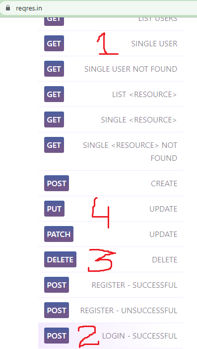

## 1. Research: CRUD App Using GetX

- Keywords:
    - flutter getx crud api
    - get data from firebase using getx flutter
    - flutter getx api example
    - api integration in flutter
    - flutter getx rest api
    - flutter getx post request
    - getx flutter
    - flutter getx list obs
    - getx tutorial
    - getx github
    - getx documentation
    - getx flutter example github
    - flutter getx http request
    - flutter getx login example github
    - flutter getx mvc
    - flutter rest api tutorial
    - flutter rest api crud
- Video
  Title: _[Add here a short, interesting and descriptive title for the video that contains high ranking keywords]_

## 2. Research: Competitors

**Flutter Videos/Articles**

- 3K: https://www.youtube.com/watch?v=Uw6oAudBEmI
- 1.9K: https://www.youtube.com/watch?v=hiOqM5zUwIQ
- 1K: https://www.youtube.com/watch?v=fjnAQB18hLI
- 12K: https://www.youtube.com/watch?v=h-D_kvXYmDo
- 3.3K: https://www.youtube.com/watch?v=S-yIDPBYzi4
- https://pub.dev/packages/get
- https://pub.dev/documentation/get/latest/
- https://medium.flutterdevs.com/rest-api-using-getx-c5f40324dfcb
- https://www.kindacode.com/snippet/using-getx-to-make-get-post-requests-in-flutter/
- https://morioh.com/p/cc5a56fba35c
- https://medium.com/@karangore518/flutter-with-getx-8d91aa9649f3
- https://protocoderspoint.com/flutter-make-get-post-request-using-getx-package/
- https://www.dbestech.com/tutorials/flutter-getx-http-request-get-and-post-method

**Android/Swift/React Videos**

- 39K: https://www.youtube.com/watch?v=hrp_RebjZE4
- 2.5K: https://www.youtube.com/watch?v=s_WAbLHZMWg
- 51K: https://www.youtube.com/watch?v=s_WAbLHZMWg
- 55K: https://www.youtube.com/watch?v=xKEFGsMUG8s
- 22K: https://www.youtube.com/watch?v=TJpk7ezvtGo
- 2.1K: https://www.youtube.com/watch?v=IvYNQimoh2c
- 4.9K: https://www.youtube.com/watch?v=9au-6bVVJBQ
- 15K: https://www.youtube.com/watch?v=OOiScZSz6V0
- https://johncodeos.com/how-to-make-post-get-put-and-delete-requests-with-retrofit-using-kotlin/
- https://www.javaguides.net/2019/05/okhttp-delete-request-java-example.html
- https://medium.com/swlh/restful-api-design-get-post-put-patch-delete-a-walkthrough-with-javascripts-fetch-api-e37a8416e2a0
- https://johncodeos.com/post-get-put-delete-requests-with-httpurlconnection/
- https://rahul9650ray.medium.com/how-to-implement-rest-api-in-android-using-retrofit-in-kotlin-part-3-c74e8e22792
- https://scripttes.blogspot.com/2018/09/alamofire-get-post-put-and-delete.html

**Great Features**

- GetX is an extra-light and powerful solution for Flutter. It combines high-performance state
  management, intelligent dependency injection, and route management quickly and practically.
- You can find more features at [pub.dev](https://pub.dev/documentation/get/latest/).

**Problems from Videos**

- NA

**Problems from Flutter Stackoverflow**

- https://stackoverflow.com/questions/73185346/getx-the-improper-use-of-a-getx-has-been-detected
- https://stackoverflow.com/questions/73402120/improper-use-of-a-getx-has-been-detected-flutter

## 3. Video Structure

**Main Points / Purpose Of Lesson**

1. By watching this video, you will be able to perform CRUD operations on any flutter app.
2. Main points:
    - Two flutter packages `get` and `http` are used.
    - Mock server [reqres.in](https://reqres.in/) is used.
    - Getx controllers are used in this project to change the state of widgets.
    - You can get, post, put(update) and delete user by watching this video.
3. Hence, GetX is very useful for navigation and specifically state management.

**The Structured Main Content**

1. Run `pub add get` and `pub add http` in terminal to add GetX and HTTP packages in your project.
2. For this video, there is no need of setup for Android and iOS.
3. First of all, replace `MaterialApp` with `GetMaterialApp` in `my_app.dart` to use GetX package in
   your project.
4. Every page in `pages` folder has relative name of controller in `getx_controllers` folder.
5. `crud_using_getx_page.dart` is the main page of app and it calls all others pages
   by `ElevatedButton`. We will perform get, post, delete and put respectively.
   <br/> 
6. For `get_user_page.dart`, it uses `get_user_controller.dart`. `GetUserController`
   extends `GetxController` which is part of `package:get/get.dart`. Initialize the following
   in `get_user_controller.dart`:

```dart

final idController = TextEditingController().obs;
final userData = ''.obs;
final loading = false.obs;
```

`idController` receives id of user from TextField in UI.
<br/>`userData` will store the data received from API and show below the button.
<br/>`loading` is used for when user taps the button, it will show progress indicator until the
function of that specific button in performed.

- `obs` is part of GetX package. It means `observable` to observe the changes in these fields.
- To use these fields anywhere, use `.value` at the end fields name.
- Always use the `try-catch` block for API requests. Following is the `getUserApi()` method:

```dart
void getUserApi() async {
  loading.value = true;
  try {
    final response = await get(
      Uri.parse('https://reqres.in/api/users/${idController.value.text}'),
    );
    final data = jsonDecode(response.body);
    debugPrint('statusCode: ${response.statusCode}\ndata => $data');
    if (response.statusCode == 200) {
      loading.value = false;
      userData.value = data.toString();
      Get.snackbar('Congrats!',
          'User${idController.value.text} data loaded successfully');
    } else {
      loading.value = false;
      Get.snackbar(data['error'],
          'User${idController.value.text} data loading failed');
    }
  } catch (e) {
    loading.value = false;
    Get.snackbar('Exception', e.toString());
  }
}
```

Always initialize the controller class in the page where you want to use it.
<br/> For `get_user_page.dart`, initialize the `GetUserController` class to use it here.

```dart

final getUserController = Get.put(GetUserController());
```

`get_user_page.dart` code:

```dart 
        body: SingleChildScrollView(
          child: Center(
            child: Padding(
              padding: const EdgeInsets.symmetric(horizontal: 20.0),
              child: Column(
                children: [
                  TextFormField(
                    controller: getUserController.idController.value,
                    decoration: const InputDecoration(hintText: 'User ID'),
                  ),
                  const SizedBox(height: 24),
                  Obx(
                    () => getUserController.loading.value
                        ? const CircularProgressIndicator()
                        : ElevatedButton(
                            onPressed: getUserController.getUserApi,
                            child: const Text('Get user'),
                          ),
                  ),
                  const SizedBox(height: 24),
                  Obx(
                    () => Text(getUserController.userData.value),
                  ),
                ],
              ),
            ),
          ),
        ),
```

Wrap the widget with `Obx` to observe and listen the changes in fields whose state changes like
this: `Obx(() => WidgetSateWhichIsToBeChanged)`
<br/> In this page, `ElevatedButton` and `Text` widget state changes. So, both are wrapped with Obx.

7. Same case is for all other pages.